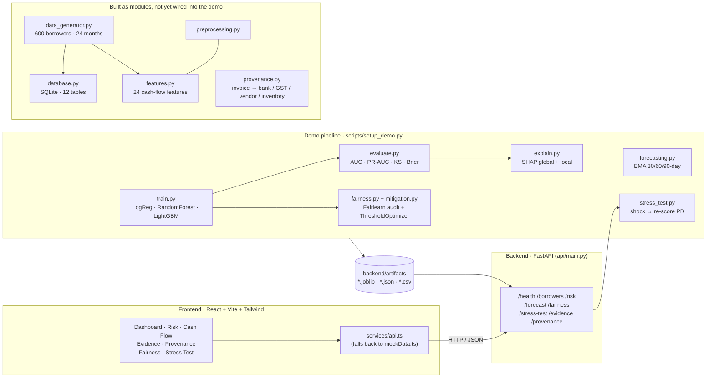

<div align="center">

# 🔍 CashFlow-Lens

**Explainable, evidence-aware credit risk analytics for MSMEs**

*Predict → Explain → Forecast → Audit → Stress test → Human decision support*


</div>

---

## What this is

CashFlow-Lens is a credit-risk decision-support dashboard for small-business (MSME) lending. It looks at a borrower's cash-flow behaviour, predicts a probability of default (PD), explains *why* using SHAP, projects the next 30/60/90 days of liquidity, audits the model for group fairness, and lets an underwriter run "what if sales drop 20%?" stress scenarios.

It never approves or rejects a loan. It only produces guidance such as **Continue Monitoring**, **Additional Evidence Required** or **Manual Review Recommended**, and a human makes the call.

> ⚠️ **All data is synthetic.** There is no connection to any bank, UPI, GST or government system. Risk thresholds are illustrative, not banking standards.

---

## Architecture



Solid boxes in the middle are what `setup_demo.py` and the API actually run today. The bottom box is code that is written and importable but not connected to that path yet. See [Implementation status](#implementation-status) for the honest breakdown.

---

## Modules

### Backend (`backend/src`)

| Module | What it does |
|---|---|
| `train.py` | Stratified 80/20 split, median-impute + scale numerics, one-hot categoricals, trains Logistic Regression, Random Forest and LightGBM (all class-balanced) |
| `evaluate.py` | ROC-AUC, PR-AUC, precision, recall, F1, Brier score, KS statistic, confusion matrix → `evaluation_metrics.json` |
| `explain.py` | SHAP `TreeExplainer`; global importance CSV; per-borrower signed contributions and plain-English reason codes (top 3 risk-increasing, top 3 risk-decreasing) |
| `forecasting.py` | Rolls transactions into daily inflow/outflow, takes a 30-day EMA, projects 30/60/90-day inflow, outflow, net cash flow, balance, a DSCR proxy and a Low/Medium/High liquidity-pressure label |
| `fairness.py` | Fairlearn `MetricFrame` per group (TPR, FPR, FNR, selection rate, precision, recall) plus equal-opportunity, equalized-odds, demographic-parity and predictive-equality differences. Manual fallback if Fairlearn is missing |
| `mitigation.py` | Fairlearn `ThresholdOptimizer` (equalized odds) on the already-computed probabilities, then a baseline vs mitigated comparison report |
| `stress_test.py` | Applies sales / input-cost / interest / opex shocks to a borrower's features, re-scores PD and reports the risk-segment migration |
| `data_generator.py` | Synthetic longitudinal MSME data with 10 tables, 7 injectable inconsistency scenarios and a leakage-safe timeline (see below) |
| `features.py` | 24 cash-flow features in 8 groups, built only from data before the application date |
| `preprocessing.py` | Cleaning and validation, leakage assertion, borrower-level split, quantile clipper, sklearn preprocessor |
| `database.py` | SQLAlchemy Core + pandas SQLite layer, 12 tables |
| `provenance.py` | Builds evidence edges and a per-borrower provenance graph: Claimed Revenue → Invoice → Bank / GST record / Vendor / Inventory |
| `config.py`, `utils.py` | YAML settings loader with built-in defaults, plus helpers (logging, seeding, JSON, date and similarity utilities) |

### Synthetic data design

- **Timeline:** 18-month observation window → application date → 6-month outcome window. Features only see the first window.
- **Target:** `default_flag = 1` if the borrower misses 2+ consecutive EMIs of the loan taken at the application date. It is drawn from a noisy latent probability, not a formula of any visible feature.
- **Borrowers:** 600 by default, Micro / Small / Medium, six sectors, five regions.
- **Inconsistency scenarios (for demos and tests only, never model inputs):** unsettled invoices, GST revenue mismatch, duplicate invoices, vendor identity mismatch, inventory shortfall, pre-application inflow spike, round-trip transfers.

### Feature groups (`features.py`)

`cash_flow_level` · `volatility` · `trend` · `cost_structure` · `debt_service` · `concentration` · `activity` · `repayment_history`

### Decision-support rules (`/risk`)

| PD | Segment | Guidance |
|---|---|---|
| below 0.15 | Low Risk | Continue Monitoring |
| 0.15 – 0.35 | Medium Risk | Continue Monitoring, or Additional Evidence Required if PD is above 0.25 |
| 0.35 and above | High Risk | Manual Review Recommended |

---

## API

| Method | Endpoint | Returns |
|---|---|---|
| GET | `/health` | Model and data load status |
| GET | `/borrowers` | First 50 borrower IDs |
| GET | `/borrowers/{id}` | Raw feature values for one borrower |
| GET | `/risk?borrower_id=` | PD, risk segment, guidance, reason codes, top SHAP contributions |
| GET | `/forecast?borrower_id=` | 30d / 60d / 90d forecast from a saved artifact |
| GET | `/fairness` | Baseline vs mitigated fairness report |
| POST | `/stress-test` | Baseline vs stressed PD and risk migration |
| GET | `/evidence?borrower_id=` | Evidence-integrity checks (currently fixed sample output) |
| GET | `/provenance?borrower_id=` | Revenue lineage trace (currently fixed sample output) |

Interactive docs are at `http://localhost:8000/docs` once the server is running.

---

## Frontend (`frontend/src`)

React 18 + TypeScript + Vite, Tailwind (teal brand palette, Inter font), Recharts for charts, lucide-react for icons, React Router for navigation.

| Route | Page | Shows |
|---|---|---|
| `/` | Dashboard | KPI cards, underwriter decision support, 90-day liquidity outlook |
| `/risk` | Risk Analytics | PD, SHAP contribution chart, generated reason codes |
| `/cashflow` | Cash Flow | 90-day projection chart and 30/60/90 outlook cards |
| `/evidence` | Evidence Integrity | Document reconciliation checks and alerts |
| `/provenance` | Provenance | Data lineage trace for revenue claims |
| `/fairness` | Fairness Audit | Baseline vs mitigated disparities and TPR by group |
| `/stress-test` | Stress Testing | Shock inputs, baseline vs stressed risk, impact summary |
| `/profile` | Borrower Profile | Raw model-input features |

`services/api.ts` calls the backend and quietly falls back to `services/mockData.ts` if a request fails, so the UI always renders. Set `VITE_DEMO_MODE=true` to force mock data, or `VITE_API_URL` to point at a different backend. The pages currently use a fixed borrower, `DEMO-001`.

---

## Getting started

Run these from the **repo root** (the demo script and API use `backend/artifacts` relative paths).

**1. Backend**

```bash
python -m venv venv && source venv/bin/activate      # Windows: venv\Scripts\activate
pip install -r backend/requirements.txt

python backend/scripts/setup_demo.py                  # trains models, writes artifacts
uvicorn backend.api.main:app --reload --port 8000
```

**2. Frontend**

```bash
cd frontend
npm install
npm run dev                                           # http://localhost:5173
```

**3. Tests**

```bash
cd backend && pytest
```

---

## Project structure

```text
cashflow-lens/
├── backend/
│   ├── api/main.py             # FastAPI app and endpoints
│   ├── config/settings.yaml    # thresholds, data, evidence, fairness, stress settings
│   ├── scripts/setup_demo.py   # train → evaluate → explain → fairness → forecast artifacts
│   ├── src/                    # modules listed above
│   ├── tests/                  # pytest suite
│   ├── data/  artifacts/  models/
│   ├── Dockerfile  docker-compose.yml
│   └── requirements.txt
└── frontend/
    ├── src/
    │   ├── pages/              # 8 views
    │   ├── components/         # Card, KPICard, StatusBadge, ErrorAlert, LoadingSpinner
    │   ├── layouts/            # sidebar + header shell
    │   ├── services/           # api.ts, mockData.ts
    │   └── types/api.ts
    └── package.json
```

---

## Implementation status

| Area | Status | Notes |
|---|---|---|
| Model training, evaluation, SHAP | ✅ Built | Trains and evaluates three models and saves a SHAP explainer for LightGBM. The API expects a file named `primary_model.joblib`, which training does not save yet |
| Fairness audit and mitigation | ✅ Built | Demo run audits a `gender` column on the demo dataset |
| Cash-flow forecast | ✅ Built | The saved demo forecast is computed from sample transactions for one borrower |
| Stress testing | ✅ Built | Shocks are applied by matching feature names (inflow, cost, outflow, debt service) |
| Frontend (all pages) | ✅ Built | Works against the API or mock data |
| Synthetic data generator, features, DB, preprocessing | 🧩 Module only | Complete and importable, but `setup_demo.py` does not call them yet (it looks for `engineer_features`, which doesn't exist in `features.py`) so the demo trains on its built-in fallback data |
| Provenance engine | 🧩 Module only | Edge and graph builders are written but depend on `evidence_integrity.py` |
| Evidence integrity engine | 🚧 Placeholder | `evidence_integrity.py` is an empty file. `/evidence` and `/provenance` return fixed sample JSON |


---

